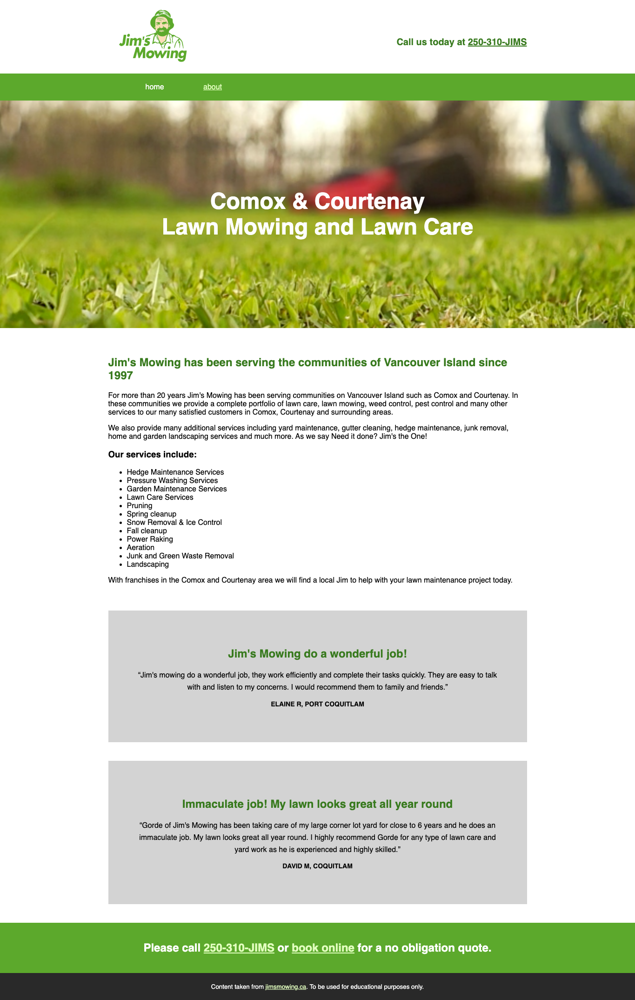
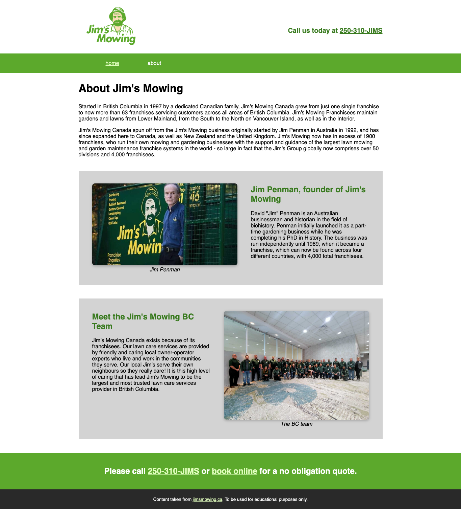

# Exercise 3

## Objectives
The provided code is the HTML and CSS for the home page and about page of a local company's website. However, the CSS is missing all of its selectors! You need to figure out which HTML elements to apply each style rule to, so that your finished website looks like the images below. After that, you will write some HTML and CSS of your own.



## Instructions
Remember to:
* Regularly save your files and check out what your web page looks like in a web browser.
* Make regular commits and pushes.
### Step 1: Get set up
* Clone your remote exercise repository onto your local machine.
* Add a comment in the head element of the homepage including: the course code and your section number - your name - Exercise 3. Example:
```
<!-- DGL 103 CVS1 - your name - Exercise 3 -->
```
### Step 2: Add the selectors
Note: The syntax of a CSS comment is different to the syntax of an HTML comment.
* Read through the HTML files and the CSS file and compare them to the images of the finished webpages to figure out how to replace the comments in the stylesheet with appropriate selectors. You may need to use class, element (type), or descendant selectors. There are many different correct ways that you could complete this exercise.<br>
Pay attention to how CSS comments were used to identify different groups of style rules. Adding organizational comments doesn't affect the code, but it helps you keep your CSS tidy and easier to read. Only replace the comments that indicate where a selector should be. Example: 
```
/* all the paragraphs */ {
  color: red;
}
```
The above CSS comment might be replaced with:
```
p {
  color: red;
}
```
### Step 3: Write your own code
* Add a new group of content anywhere in either one of the HTML files. You will need to write the content and the HTML yourself. Include at least four different types of HTML elements in your new group of content.
* Style your new content using all of the following:
    * An ID selector
    * A class selector
    * A descendant selector
    * Add one internal (embedded) style rule
    * Add one inline style rule

### Step 4: Format and Add comments 
* Use the Prettier VSCode extension to format your code.
* Add a few comments to explain your HTML and CSS code and highlight anything of interest.

### Step 5: Check for errors
Use the VSCode HTMLHint extension and validate your code to make sure that it is correct(https://validator.w3.org/#validate_by_upload for HTML, https://jigsaw.w3.org/css-validator/ for CSS).

### Step 6: Submit your work
1. Commit your changes.
2. Push your changes to GitHub. 
3. Submit in Brightspace to the "Unit 1 Exercises" assignment and follow the instructions. This is your last exercise of the unit:
    * Grade all three of your exercises and answer the reflection questions.
4. If you have been using a lab computer on campus, remember to restart the computer.

## Deadlines
Assignments must be submitted before the end of the week but they will only be graded at the end of every unit. Late assignments will not be accepted and will receive an F. You can complete and submit a contract that allows you to extend the deadline for an assignment but you must email it to your instructor a minimum of 48 hrs before the deadline. Deadline extensions are only allowed for those unplanned, unexpected emergencies that life sometimes throws at us, and they will only be approved by your instructor if you follow the correct process. See the Course Info folder in BrightSpace for more info.